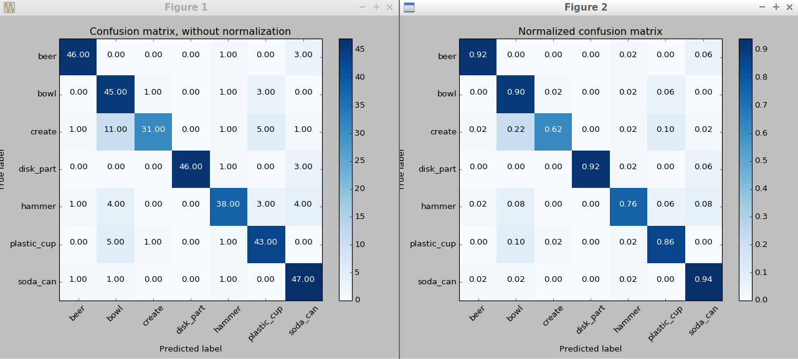
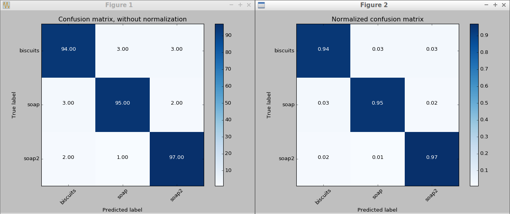
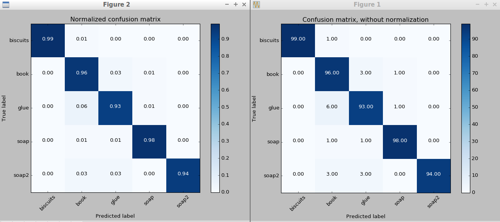
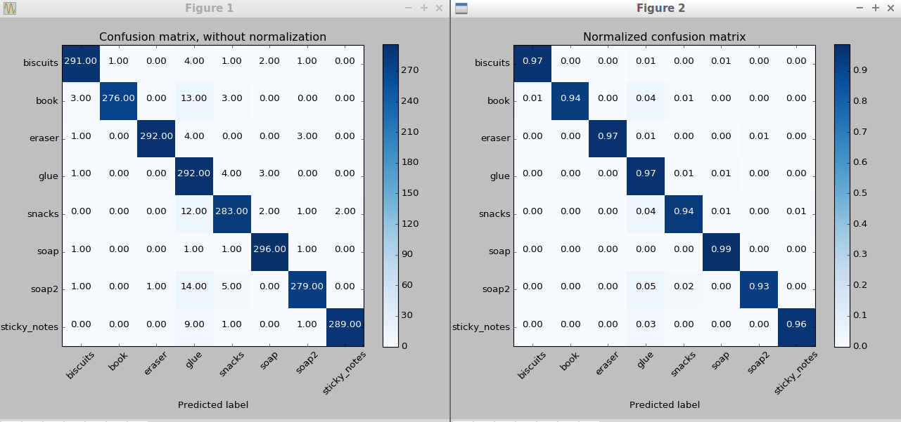

# Project: Perception Pick & Place

---

## Required Steps for a Passing Submission:
1. Extract features and train an SVM model on new objects (see `pick_list_*.yaml` in `/pr2_robot/config/` for the list of models you'll be trying to identify). 
2. Write a ROS node and subscribe to `/pr2/world/points` topic. This topic contains noisy point cloud data that you must work with.
3. Use filtering and RANSAC plane fitting to isolate the objects of interest from the rest of the scene.
4. Apply Euclidean clustering to create separate clusters for individual items.
5. Perform object recognition on these objects and assign them labels (markers in RViz).
6. Calculate the centroid (average in x, y and z) of the set of points belonging to that each object.
7. Create ROS messages containing the details of each object (name, pick_pose, etc.) and write these messages out to `.yaml` files, one for each of the 3 scenarios (`test1-3.world` in `/pr2_robot/worlds/`).  [See the example `output.yaml` for details on what the output should look like.](https://github.com/udacity/RoboND-Perception-Project/blob/master/pr2_robot/config/output.yaml)  
8. Submit a link to your GitHub repo for the project or the Python code for your perception pipeline and your output `.yaml` files (3 `.yaml` files, one for each test world).  You must have correctly identified 100% of objects from `pick_list_1.yaml` for `test1.world`, 80% of items from `pick_list_2.yaml` for `test2.world` and 75% of items from `pick_list_3.yaml` in `test3.world`.
9. Congratulations!  Your Done!

## [Rubric Points](https://review.udacity.com/#!/rubrics/1067/view) 
### Here I will consider the rubric points individually and describe how I addressed each point in my implementation.  

---

### Writeup / README

#### 1. Provide a Writeup / README that includes all the rubric points and how you addressed each one.  You can submit your writeup as markdown or pdf.  

I wrote it in the format of a Jupyter Notebook as usual, then exported as a markdown file.

### Exercise 1, 2 and 3 pipeline implemented
#### 1. Complete Exercise 1 steps. Pipeline for filtering and RANSAC plane fitting implemented.

Here is part of the code. The complete implemenation is gathered into a model called RANSAC.py. The details of the tweaking for the parameters is noted in the comments.


```python
# Load Point Cloud file
cloud = pcl.load_XYZRGB('tabletop.pcd')

# Voxel Grid filter
# Create a VoxelGrid filter object for out input point cloud
vox = cloud.make_voxel_grid_filter()

# choose a voxel (leaf) size
# LEAF_SIZE = 0.0001 # this is warned by the script to be too small
# LEAF_SIZE = 0.001 # same as above
LEAF_SIZE = 0.01  # no warning for this value, try a larger value
# LEAF_SIZE = 0.1 # this is too large to show any feature
# tried 0.01 ~ 0.05, 0.01 is the best

# Set voxel size
vox.set_leaf_size(LEAF_SIZE, LEAF_SIZE, LEAF_SIZE)

# call the filter funciton to obtain the resultant downsampled point cloud
cloud_filtered = vox.filter()
filename = 'voxel_downsampled.pcd'
pcl.save(cloud_filtered, filename)

# PassThrough filter
# Create a PassThrough filter objects
passthrough = cloud_filtered.make_passthrough_filter()

# Assign axis and range to the passthrough filter objects
filter_axis = 'z'
passthrough.set_filter_field_name(filter_axis)

# set the limits
# for the quiz in lesson 3-11
#axis_min = 0.8  # this removes the table
#axis_max = 2

#axis_min = 0.1  # this removes the objects on the table, leaves only the table
#axis_max = 0.8

#axis_min = 0  # this includes everything
#axis_max = 2

axis_min = 0.6  # this retains the table and the objects
axis_max = 1.1

passthrough.set_filter_limits(axis_min, axis_max)

# Finally, use the filter function to obtain the resultant point cloud
cloud_filtered = passthrough.filter()
filename = 'pass_through_filtered.pcd'
pcl.save(cloud_filtered, filename)

# RANSAC plane segmentation
# Create the segmentation object
seg = cloud_filtered.make_segmenter()

# Set the model you wish to filter
seg.set_model_type(pcl.SACMODEL_PLANE)
seg.set_method_type(pcl.SAC_RANSAC)

# Max distance for a point to be considered fitting the model
# For lesson 3-15 quiz 1
# max_distance = 1  # this includes everything
# max_distance = 0.1 # this removes the tall objects
max_distance = 0.01 # this leaves only the table
# max_distance = 0.001 # this might be unnessessarily high

seg.set_distance_threshold(max_distance)

# Call the segment function to obtain set of inlier indices and model coefficients
inliers, coefficients = seg.segment()

# Extract inliers
extracted_inliers = cloud_filtered.extract(inliers, negative=False)
filename = 'extracted_inliers.pcd'
pcl.save(extracted_inliers, filename)

# Extract outliers
extracted_outliers = cloud_filtered.extract(inliers, negative=True)
filename = 'extracted_outliers.pcd'
pcl.save(extracted_outliers, filename)
```

#### 2. Complete Exercise 2 steps: Pipeline including clustering for segmentation implemented.  

Here is part of the code. The complete implemenation is gathered into a model called segmentation.py. The details of the tweaking for the parameters is noted in the comments. All the filtering functions are imported through the RANSAC module.


```python
# Import modules
from pcl_helper import *
from RANSAC import *

# Define functions as required
def clustering(pcl_data):
    # Create k-d tree
    white_cloud = XYZRGB_to_XYZ(pcl_data)
    tree = white_cloud.make_kdtree()

    # Create a cluster extraction object
    ec = white_cloud.make_EuclideanClusterExtraction()

    # Set tolerances for distance threshold
    # 0.001: too small, the cluster will be too fractrized, colored like rainbow
    # 0.01: less colorful, but still mixing multiple colors onto one object
    # 0.1: nothing will show up except for the bowl at the center
    # this means the min and max numbers need to be tweaked, more specifically,
    # increase maximum
    # when it was increased to 5000, all the objects are shown, now can get back
    # to tweak this number between 0.01 and 0.1
    # a unique color is achived for each object when this number = 0.014
    ec.set_ClusterTolerance(0.014)

    # Set minimum cluster size
    # the lower this number, the more points each cluster has
    # but it cannot be too small otherwise there will be "noises" inside each
    # object
    ec.set_MinClusterSize(5)

    # Set maximum cluster size
    # the larger this number, the more ponints will show up
    # but it cannot be too large otherwise two objects may be colored into one
    ec.set_MaxClusterSize(10000)

    # Search the k-d tree for clusters
    ec.set_SearchMethod(tree)

    # Extract indices for each of the discovered clusters
    cluster_indices = ec.Extract()
    return white_cloud, tree, cluster_indices

def color_clusters(pcl_data_xyz, cluster_indices):
    # Assign a color corresponding to each segmented object in scene
    cluster_color = get_color_list(len(cluster_indices))

    # create a list for the colored cluster points
    color_cluster_point_list = []

    # traverse the indices and append to the list
    for j, indices in enumerate(cluster_indices):
        for i, indice in enumerate(indices):
            color_cluster_point_list.append([pcl_data_xyz[indice][0],
                                             pcl_data_xyz[indice][1],
                                             pcl_data_xyz[indice][2],
                                             rgb_to_float(cluster_color[j])])
    # Create new cloud containing all clusters colored
    cluster_cloud_colored = pcl.PointCloud_PointXYZRGB()
    cluster_cloud_colored.from_list(color_cluster_point_list)
    return cluster_cloud_colored

```


    ---------------------------------------------------------------------------

    ModuleNotFoundError                       Traceback (most recent call last)

    <ipython-input-1-b34674ed3746> in <module>()
          1 # Import modules
    ----> 2 from pcl_helper import *
          3 from RANSAC import *
          4 
          5 # Define functions as required


    ModuleNotFoundError: No module named 'pcl_helper'


#### 3. Complete Exercise 3 Steps.  Features extracted and SVM trained.  Object recognition implemented.

For the exercise, I was using 50 loops, HSV mode instead of RGB, and linear kernel. This was later changed to rbf kernel for the project. 

A major obstacle I encountered during the implementation of Exercise 3 is that my svm was doing poorly even after I followed all the suggestions in Lesson 5-16. As I mentioned above, I have modified the histograms functions, increased the loop number, changed the filter and even tried to change the svm kernel. All failed. Now think of it, based on the fact that there's basically no change on the performance of my svm, I should have come to the conclusion way earlier than I had, that it must be something else than wrong code that's causing this. Sadly I spent way too many days just trying to tweak all the parameters to the extreme and hoping it will work magically.

It turns out, that I was editing the wrong capture_features.py file inside the Exercise-3 folder instead of the one inside catkin_ws all the time. And I was so over my head when I discovered this that I spent another week tweaking all parameters without stopping to check if I have missed anything else. I made no obvious improvement during that week.

After talking to the third expert without a result, I suddenly realized, like a flash, that I only fixed the capture_features.py but not other files with the same problem. There was a features.py file that also requires modification, and I also made the changes inside the wrong folder.

From then it was all good. I changed the files in the correct folder, and my svm works like a charm. I can get a 70%~90% recognition with only 50 loops.

The code below shows the computation for the color and normal histograms. 


```python
def compute_color_histograms(cloud, using_hsv=False):

    # Compute histograms for the clusters
    point_colors_list = []

    # Step through each point in the point cloud
    for point in pc2.read_points(cloud, skip_nans=True):
        rgb_list = float_to_rgb(point[3])
        if using_hsv:
            point_colors_list.append(rgb_to_hsv(rgb_list) * 255)
        else:
            point_colors_list.append(rgb_list)

    # Populate lists with color values
    channel_1_vals = []
    channel_2_vals = []
    channel_3_vals = []

    for color in point_colors_list:
        channel_1_vals.append(color[0])
        channel_2_vals.append(color[1])
        channel_3_vals.append(color[2])

    # Compute histograms
    channel_1_hist = np.histogram(channel_1_vals, bins=32, range=(0, 256))
    channel_2_hist = np.histogram(channel_2_vals, bins=32, range=(0, 256))
    channel_3_hist = np.histogram(channel_3_vals, bins=32, range=(0, 256))

    # Concatenate and normalize the histograms
    hist_features = np.concatenate((channel_1_hist[0], channel_2_hist[0], channel_3_hist[0])).astype(np.float64)

    normed_features = hist_features / np.sum(hist_features)
    return normed_features


def compute_normal_histograms(normal_cloud):
    norm_x_vals = []
    norm_y_vals = []
    norm_z_vals = []

    for norm_component in pc2.read_points(normal_cloud,
                                          field_names = ('normal_x', 'normal_y', 'normal_z'),
                                          skip_nans=True):
        norm_x_vals.append(norm_component[0])
        norm_y_vals.append(norm_component[1])
        norm_z_vals.append(norm_component[2])

    # Compute histograms of normal values (just like with color)
    x_hist = np.histogram(norm_x_vals, bins=32, range=(0, 256))
    y_hist = np.histogram(norm_y_vals, bins=32, range=(0, 256))
    z_hist = np.histogram(norm_z_vals, bins=32, range=(0, 256))

    # Concatenate and normalize the histograms
    hist_features = np.concatenate((x_hist[0], y_hist[0], z_hist[0])).astype(np.float64)

    normed_features = hist_features / np.sum(hist_features)
    return normed_features
```

The following code is the major part of the capture_features module. As you can see I am using 50 loops and HSV.


```python
    for model_name in models:
        spawn_model(model_name)

        for i in range(50):
            # make five attempts to get a valid a point cloud then give up
            sample_was_good = False
            try_count = 0
            while not sample_was_good and try_count < 5:
                sample_cloud = capture_sample()
                sample_cloud_arr = ros_to_pcl(sample_cloud).to_array()

                # Check for invalid clouds.
                if sample_cloud_arr.shape[0] == 0:
                    print('Invalid cloud detected')
                    try_count += 1
                else:
                    sample_was_good = True

            # Extract histogram features
            chists = compute_color_histograms(sample_cloud, using_hsv=True)
            normals = get_normals(sample_cloud)
            nhists = compute_normal_histograms(normals)
            feature = np.concatenate((chists, nhists))
            labeled_features.append([feature, model_name])

        delete_model()
```

Here is the confusion matrix of my svm for Exercise 3.


### Pick and Place Setup

#### 1. For all three tabletop setups (`test*.world`), perform object recognition, then read in respective pick list (`pick_list_*.yaml`). Next construct the messages that would comprise a valid `PickPlace` request output them to `.yaml` format. 

First of all, the svm needs to be trained for the test world. In my modified capture_features module, I have listed the models for each world in its correspoding pick list file, as shown below.


```python
if __name__ == '__main__':
    rospy.init_node('capture_node')

    # models for perception Exercise-3
    models_ex3 = [\
       'beer',
       'bowl',
       'create',
       'disk_part',
       'hammer',
       'plastic_cup',
       'soda_can']
    # 50 loops

    # models for perception project, pick list 1
    models_1 = [\
       'biscuits',
       'soap',
       'soap2']
#   50 loops are good enough to get a ~90% result, all objects recognized

    # models for perception project, pick list 2
    models_2 = [\
       'biscuits',
       'soap',
       'book',
       'soap2',
       'glue']
#   100 loops, ~90% confusion matrix, recognized 3 ~ 4 objects
#   200 loops, ~90% confusion matrix  rbf
#   500 loops, ~0.96 accuracy rbf
#   500 loops, linear, 0.94
#   100 loops, linear, normal range 256, lowest 0.93, glue is not found
#   200 loops, linear, normal range 256, all objects found

    # models for perception project, pick list 3
    models_3 = [\
        'sticky_notes',
        'book',
        'snacks',
        'biscuits',
        'eraser',
        'soap2',
        'soap',
        'glue']
#   300 loops, ~90% confusion matrix, yet only recognize books
#   300 loops, linear, normal 256. only glue is not found

    # models = models_1
    # models = models_2
    models = models_3
```

And here is a confusion matrix for the models for test world 1. The model file was named model_1.sav.


A confusion matrix for the models for test world 2. The model file was named model_2.sav.


A confusion matrix for the models for test world 3. The model file was named model_3.sav.


For the project, I have organized the perception pipeline inside the perception.py module. As you can see from below, the callback function is mostly performing segmentation as in Exercise 3, and the major part of the ROS message construction and yaml file output is done inside the mover function. Since I am skipping the actual pick and place movement for now, I have commented out the related code to speed things up.

Another optimization I have done is that, instead of traversing the detected object list for comparison for each object in the pick list, I constructed a dictionary using the label of the detected object as the key and its centroid as the value. That way we can save a double loop and gain access to the centroid quickly later.

#### Major Difficulties

During the perception process, I had a very difficult time recognizing the objects even though my svm can get a high enough score during training. For test world 1, I was able to recognize all 3 objects with correct labels; but things began to fall swiftly with test world 2. 

At first I kept all the parameters the same as in the exercises, and the svm recognized more objects than it should have, with the labels all messed up. Worse is, it recognized the dropboxes on the sides and labeled them as one of the objects. ("glue", specifically) Initially I was inclined to the easy conclusion that my feature set was not big enough, that I should just throw a 5 digit loop number to it and go to sleep; but then I remembered the story for my exercise 3 and I convinced myself that there must be something else that's causing this strange issue. So I went back to the course material, hoping to dig deeper for some clue that I may have missed before. 

After reading the pass through filtering section, I suddenly realized that we are only filtering the cloud on the z axis. Why can't we do the same on the y axis, so as to get rid of the dropboxes on the sides, leaving only the table and objects in the center? So I applied the passthrough filter along y axis, and the dropboxes was filtered out successfully. However, the recognition was also destroyed. The svm recognized all objects, but they are labeled the same, or with no more than two to three labels. Looks like that I have to find some other way to help with my recognition.

I reached out to the experts, and during our conversation, he mentioned that the range of my normal histogram calculation was wrong. Initially, I was using (0, 256), the same as the color histogram. But that was before I found my "wrong folder" mistake. So I reached out for help, and was told by another expert that I should use range (-1, 1) to fix it. However, this has messed up the label completely, though my perception code was verified by different experts and they all confirmed that part was correct. So I changed it back to (0, 256), but the result was still not good enough. 

After countless conversations with the experts, a conclusion has been made that a single configuration for all 3 test worlds may not be an optimal way. Instead, I might have to tweak the parameters, namely, the feature set number, the kernel for svm, and the size of the passthrough filter accordingly for each test world. So after an seemingly endless journey of tweaking and fine-tuning, here are my final configurations for different cases:

1. Test world 1: 
   * 50 loops for each model;
   * Linear kernel;
   * Pass through z axis as we did in exercise 3.
   * Basically using the same parameters in exercise 3.
    
2. Test world 2:
   * 200 loops for each model;
   * Linear kernel;
   * Pass through z axis with range (0.621, 1.16);
   * Pass through y axis with range (-0.5, 0.5) to get rid of dropboxes;
   * Increase the minimum cluster size to 10. 
   
3. Test world 3:
   * 300 loops for each model;
   * Linear kernel;
   * Pass through z axis with range (0.55, 1);
   * Pass through y axis with range (-0.5, 0.5) to get rid of dropboxes;
   * Use a minimum cluster size of 5.
    
With these changes in configuration, the svm was able to recognize and label most of the objects in test world 2 and 3. One of the most helpful change was the switch from rbf kernel to linear kernel. The feature set generated by rbf kernel performed extremely bad in labeling the objects, and for most of the time, all the objects in test world 2 and 3 would be labeled as "books". 

The output file is named output_1.yaml, output_2.yaml, output_3.yaml as required and is included inside this repo.


```python
# function to load parameters and request PickPlace service
def pr2_mover(object_list):

    # Initialize variables
    test_scene_num = Int32()
    # test_scene_num.data = 1  # test world 1
    # test_scene_num.data = 2  # test world 2
    test_scene_num.data = 3  # test world 3

    object_name = String()
    arm_name = String()
    pick_pose = Pose()
    place_pose = Pose()

    # create a dictionary to hold the names and its cloud data in the object_list
    centroids_dic = {}

    # traverse the object_list, build the dictionary
    for detected_object in object_list:
        label = detected_object.label
        points_arr = ros_to_pcl(detected_object.cloud).to_array()
        centroid = np.mean(points_arr, axis=0)[:3]
        centroids_dic[label] = centroid

    # Get/Read parameters
    object_list_param = rospy.get_param('/object_list')
    drop_pose_param = rospy.get_param('/dropbox')

    for i in range(0, len(drop_pose_param)):
        if drop_pose_param[i]['name'] == 'left':
            drop_pose_left = drop_pose_param[i]['position']
        else: # right
            drop_pose_right = drop_pose_param[i]['position']

    # TODO: Rotate PR2 in place to capture side tables for the collision map

    # create the dict list
    dict_list = []
    print("num of obj: " + str(len(object_list_param)))
    # Loop through the pick list
    for i in range(0, len(object_list_param)):
        # Parse parameters into individual variables
        object_name.data = object_list_param[i]['name']
        object_group = object_list_param[i]['group']

        # Assign the arm to be used for pick_place
        if object_group == 'green':
            arm_name.data = 'right'
            object_drop_pos = drop_pose_right
        else:  # group == red
            arm_name.data = 'left'
            object_drop_pos = drop_pose_left

        # Get the PointCloud for a given object and obtain it's centroid
        # get the centroid from the dictionary
        if object_name.data in centroids_dic:
            centr = centroids_dic[object_name.data]
            pick_pose.position.x = np.asscalar(centr[0])
            pick_pose.position.y = np.asscalar(centr[1])
            pick_pose.position.z = np.asscalar(centr[2])
        else:
            print(object_name.data + " was not found!")
            pick_pose.position.x = 0.0
            pick_pose.position.y = 0.0
            pick_pose.position.z = 0.0

        # Create 'place_pose' for the object
        place_pose.position.x = object_drop_pos[0]
        place_pose.position.y = object_drop_pos[1]
        place_pose.position.z = object_drop_pos[2]

        # Create a list of dictionaries (made with make_yaml_dict()) for later output to yaml format
        yaml_dict = make_yaml_dict(test_scene_num, arm_name, object_name, pick_pose, place_pose)
        dict_list.append(yaml_dict)
        # Wait for 'pick_place_routine' service to come up
        #rospy.wait_for_service('pick_place_routine')

        #try:
        #    pick_place_routine = rospy.ServiceProxy('pick_place_routine', PickPlace)

            # TODO: Insert your message variables to be sent as a service request
        #    TEST_SCENE_NUM = test_scene_num
        #    OBJECT_NAME = object_name
        #    WHICH_ARM = arm_name
        #    PICK_POSE = pick_pose
        #    PLACE_POSE = place_pose

        #    resp = pick_place_routine(TEST_SCENE_NUM, OBJECT_NAME, WHICH_ARM, PICK_POSE, PLACE_POSE)

        #    print ("Response: ",resp.success)

        #except rospy.ServiceException, e:
        #    print "Service call failed: %s"%e

    # Output your request parameters into output yaml file
    print "now ouput to yaml"
    #yaml_filename = 'output_1.yaml'
    # yaml_filename = 'output_2.yaml'
    yaml_filename = 'output_3.yaml'
    send_to_yaml(yaml_filename, dict_list)
```

### Improvements

1. Completed the pick and place routine. As shown above, I have completely skipped the actual pick and place routine with the lack of time. In the future, I plan to add the routine to the project, and complete the pick and place movement, as well as the fourth world where we were given more freedom in creating the environment.
2. Perfection of the perception pipeline. Currently, my pipeline can recognize and label most of the objects in each world, but not all of them. Especially, it had a very difficult time recognizing the glue in world 3. Besides, the recognition is not consistent; the label of the objects would change continuously. I would need to add some other technique to the pipeline to stablize the labeling, and increase the accuracy so as to recognize all the objects.
